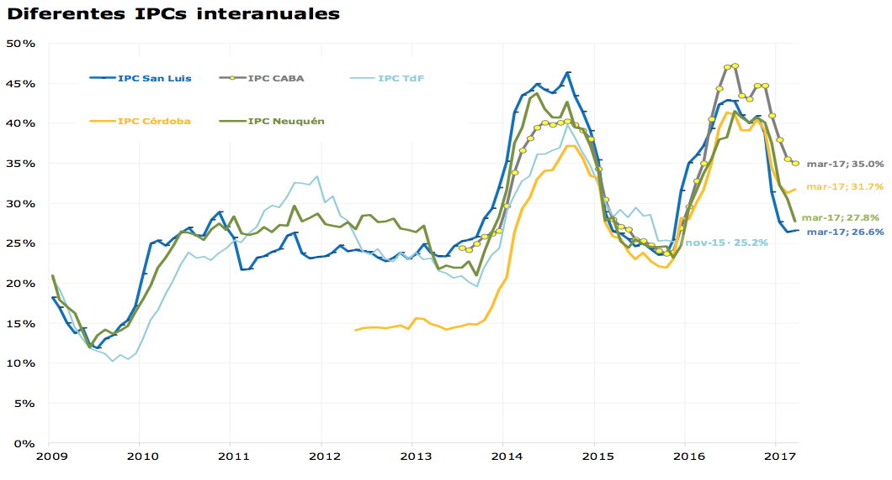
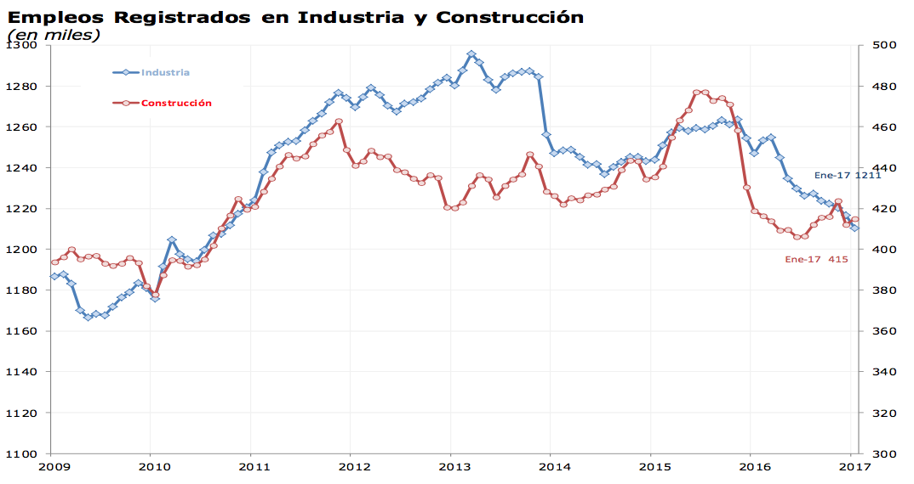
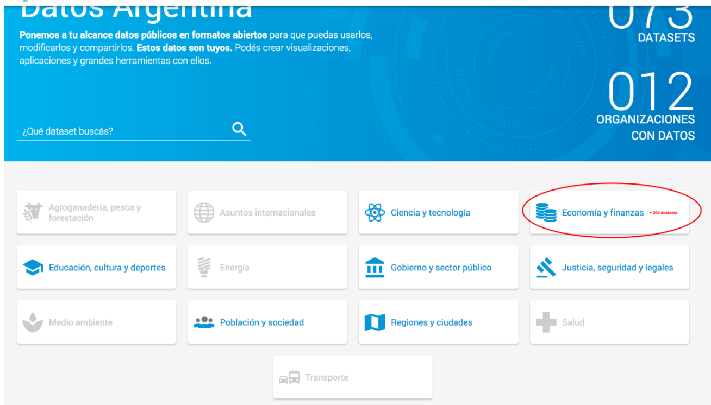
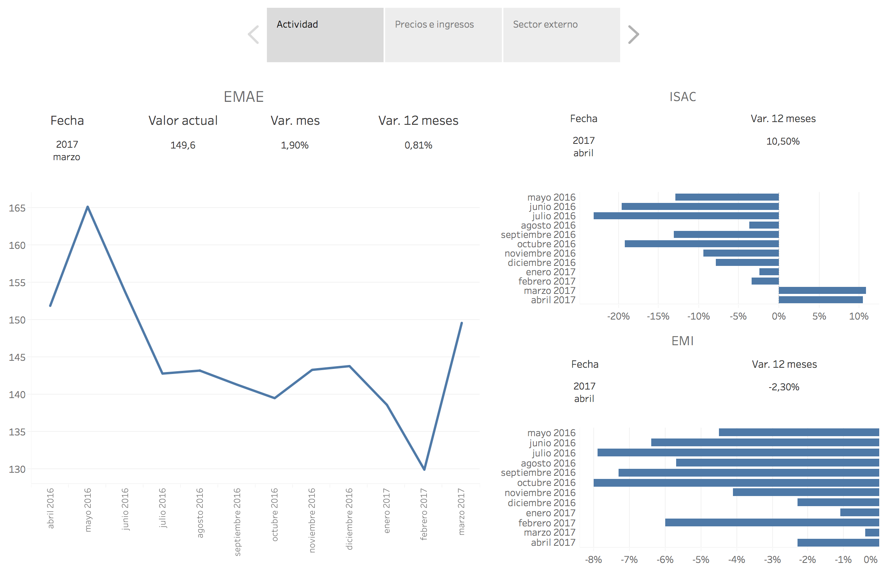
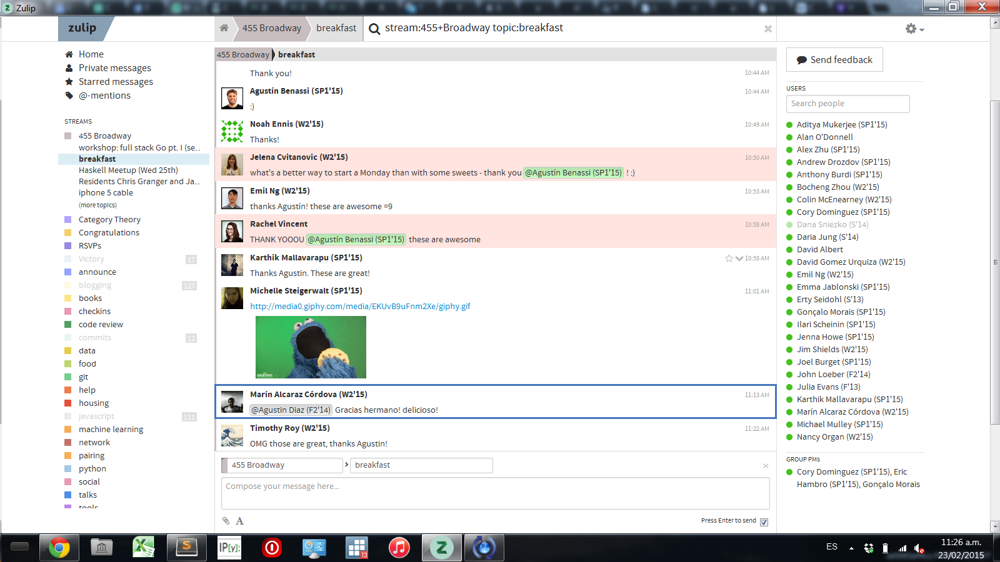
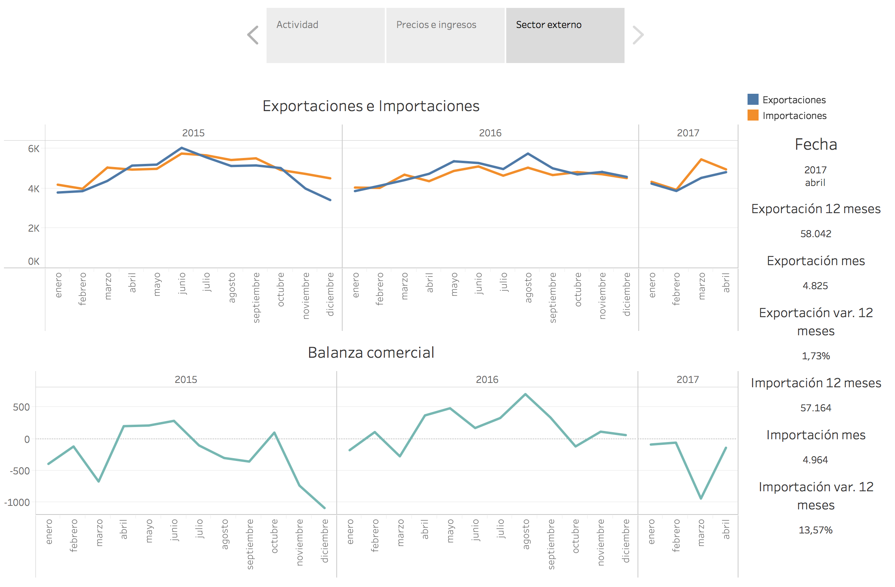
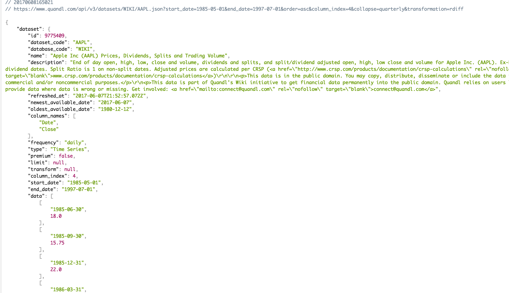
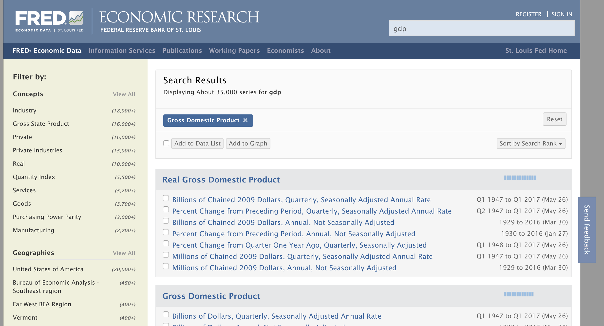
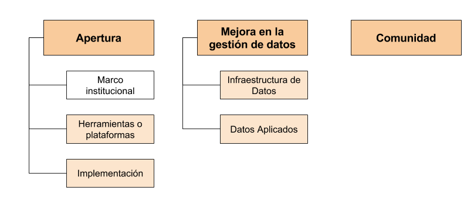

title: Series de Tiempo
output: index.html
controls: false
progress: true
style: style.css

--
# Proyecto Series de Tiempo
## Una base de series de tiempo para Argentina

-- separator
# ¿Qué son?

## Datos con **dimensión temporal**: muestran la evolución de un indicador con frecuencia crónica

--
### ¿Qué son?

--
### ¿Qué son?

--
### ¿Para qué se usan?

* Coyuntura socioeconómica

* Evaluación de resultados

* Análisis de correlación

* Evolución histórica

-- separator
# ¿Qué vamos a hacer?

--
### Catálogo de series de tiempo

--
### Catálogo de series de tiempo

--
### Catálogo de series de tiempo

--
### Dashboard de seguimiento de coyuntura

--
### Dashboard de seguimiento de coyuntura

--
### Dashboard de seguimiento de coyuntura

--
### API de series de tiempo
###### *https://www.quandl.com/api/v3/datasets/WIKI/AAPL.json?start_date=1985-05-01&end_date=1997-07-01&collapse=quarterly&transformation=rdiff *######

--
### Web de búsqueda, exploración y descarga

--
### Web de búsqueda, exploración y descarga

-- separator
# Impacto del proyecto

--
### Verticales de la Dirección Nacional

<!-- 

* **Mejora en la gestión de datos**
    - Infraestructura de Datos
    - Datos Aplicados
* **Apertura**
    - Marco institucional
    - Herramientas/plataformas
    - Implementación

 -->

--
### Profundización de la apertura

* **200 nuevos datasets**

* **Acceso a los datos como servicio**<!-- series disponibles para desarrollo de aplicaciones, reportes automáticos, dashboards, sistemas de alerta... -->

* **Consumo de datos más simple y personalizado**<!-- navegar, descubrir, combinar, descargar y compartir datos de manera más útil y personalizada -->

* **Información de coyuntura a un click**<!-- en forma más ágil y actualizada -->

--
### Mejora en la gestión de datos

* **Procesos mas sencillos y documentados**

* **Puesta en valor de trabajo pre-existente** <!-- en el desarrollo interno de estándares sub-utilizados y todavía nunca publicados -->

* **Sinergia con otros proyectos** <!-- disponibilización de indicadores clave (abiertos y no abiertos) de seguimiento de la economía para el control de gestión en tiempo real -->

* **Fortalecimiento de los procesos para compartir datos en gobierno** <!-- fácilmente entre organismos del estado -->

--
### Comunidad

* **Ampliación de la red de nodos** <!-- alianza con la SSPM que maneja datos económicos importantes para seguimiento de la economía -->

* **Tracción de nuevos focales**

* **Fortalecimiento de la comunidad interna**

<!--

### Beneficios del proyecto (2): Infraestructura de Datos

* **Mejorar la calidad**: re-estructuración de datos difíciles de usar
* **Promover el descubrimiento**: nueva modalidad de búsqueda de datos orientada a los usuarios de series de tiempo
* **Facilitar la reutilización**: consumo de datos desatendido y customizado, pensado para una variedad de casos de uso
* **Simplificar el acceso**: datos _no abiertos_ se comparten fácilmente entre organismos del estado

 -->
