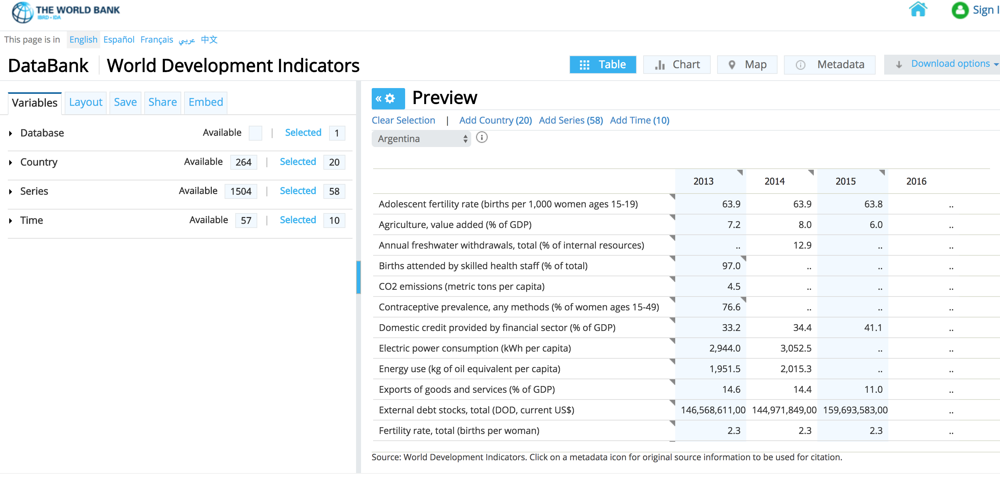
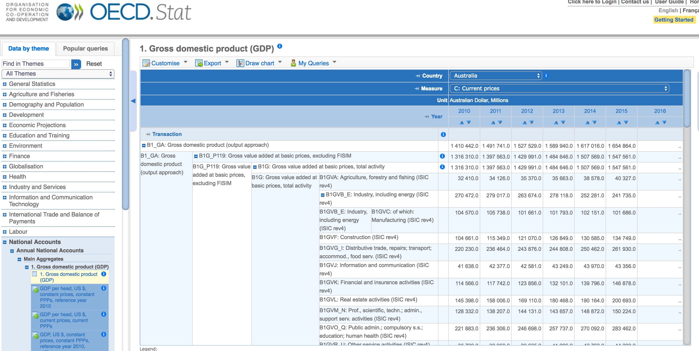
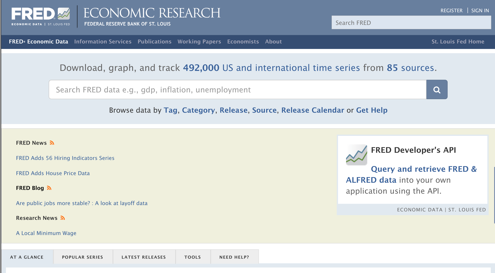

title: Series de Tiempo
output: index.html
controls: false
progress: true
style: style.css

--
# Series de Tiempo
## Datos con **dimensión temporal**: muestran la evolución de una variable con frecuencia crónica

--
### ¿Qué son?

(Screenshot de distintas series de tiempo)

--
### ¿Para qué se usan?

* Seguimiento de coyuntura
* Evaluación de impacto
* Análisis de correlación
* Evolución histórica

-- separator
# Referencias internacionales
## Bases de series de tiempo en el mundo

--
### Referencias internacionales: BM

--
### Referencias internacionales: OECD

--
### Referencias internacionales: FRED

--
### Referencias internacionales: Quandl

-- separator
# Proyecto Series de Tiempo
## Una base de series de tiempo argentina

--
### ¿Qué vamos a hacer?

* **Catálogo de series de tiempo** de la SS de Programación Macroeconómica
* **Dashboard de seguimiento de coyuntura económica** (Información Económica al Día)
* **API de series de tiempo** integrada a la Infraestructura de Datos
* **Interfaz web** de búsqueda, selección, procesamiento y descarga de series de tiempo

**TODO: separar en 4 slides con screenshots o iframes de c/cosa**

--
### Beneficios del proyecto (1): verticales de la DN

* **Apertura**: 200 nuevos datasets de la SSPM
* **Mejoras al uso**: info económica valiosa publicada en forma más ágil y actualizada
* **Mejoras en origen**: activos de datos mejor estructurados y documentados para su consumo
* **Apalancamiento de la Infraestructura de Datos**: primer cliente que empieza a usar servicios de la Infraestructura de Datos

--
### Beneficios del proyecto (2): Infraestructura de Datos

* **Mejorar la calidad**: re-estructuración de datos difíciles de usar
* **Promover el descubrimiento**: nueva modalidad de búsqueda de datos orientada a los usuarios de series de tiempo
* **Facilitar la reutilización**: consumo de datos desatendido y customizado, pensado para una variedad de casos de uso
* **Simplificar el acceso**: datos _no abiertos_ se comparten fácilmente entre organismos del estado

--
### Beneficios del proyecto (3): sinergias y alianzas

* **Nuevos partners en la APN**: alianza con la SSPM que maneja datos económicos importantes para seguimiento de la economía
* **Nueva fuente de datos para Tablero de Gestión**: disponibilización de indicadores clave (abiertos y no abiertos) de seguimiento de la economía para el control de gestión

